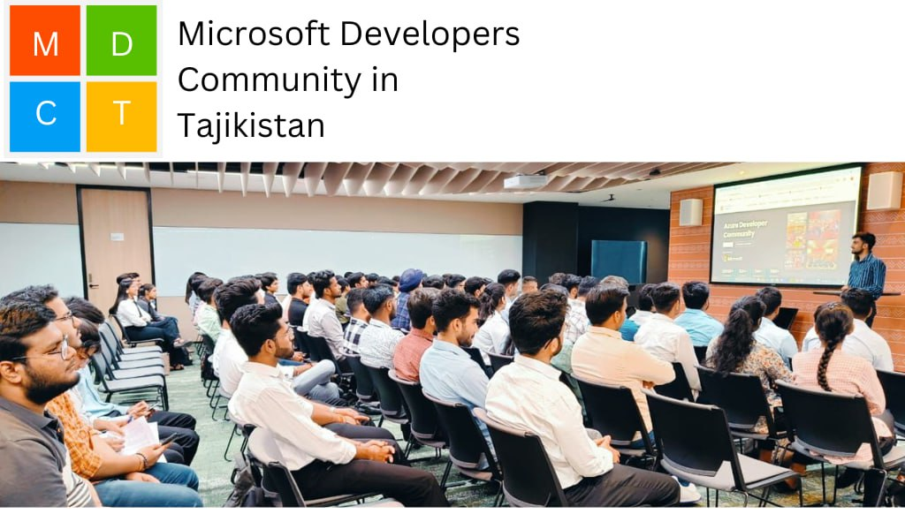
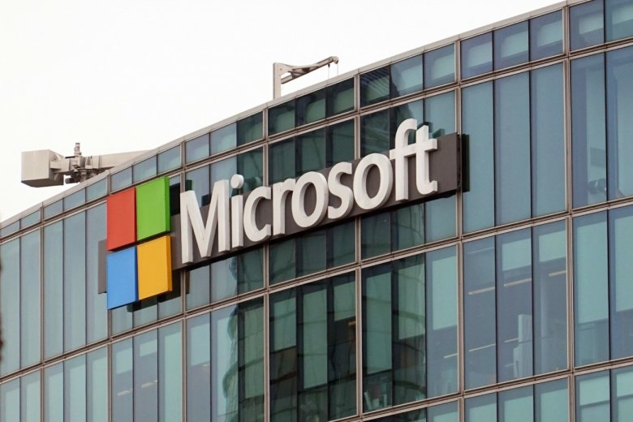

# Microsoft Developers Community in Tajikistan

**Microsoft Developers Community in Tajikistan** — ин як ҷомеаи кушода барои барномасозон аст, ки ба ҳар як барномасоз имконият медиҳад, ки донишу таҷрибаи худро ба намоиш гузорад, омӯзад ва саҳми худро гузорад. Ин ҷомеа барои омӯхтани технологияҳои Microsoft, эҷоди лоиҳаҳо дар асоси онҳо ва таҳияи ҳалли инноватсионӣ равона шудааст, ки тавассути он мо Тоҷикистонро дар соҳаи IT дар сатҳи ҷаҳонӣ муаррифӣ мекунем.

<figure><figcaption></figcaption></figure>

***

#### **Мақсадҳои ҷомеа**

1. **Ҳамгироии барномасозон**
   * Барои барномасозони ҳар сатҳ (аз шурӯъкунанда то касбӣ) майдони якҷоя барои мубодилаи донишу таҷриба фароҳам меорем.
2. **Мубодилаи дониш ва таҷриба**
   * Омӯзиши амиқи технологияҳои Microsoft:
     * .NET, Azure, Power Platform ва дигарон.
   * Омӯзиши амалияҳои беҳтарини барномасозии замонавӣ.
3. **Рушди лоиҳаҳои Open Source**
   * Ҳар як узв метавонад лоиҳаҳои нав эҷод кунад ё дар лоиҳаҳои мавҷуда иштирок намояд.
   * Таъмини шаффофият дар эҷоди лоиҳаҳо ва рушди якҷояи онҳо.
4. **Омода кардани мутахассисони соҳаи технологияҳои Microsoft**
   * Фаъолият дар платформаи мо ба барномасозон имкон медиҳад, ки ба мутахассисони сатҳи ҷаҳонӣ табдил ёбанд.
5.  **Рушди экосистемаи маҳаллии IT**

    * Эҷоди ҷомеае, ки ба стандартҳои байналмилалӣ дар соҳаи таъминоти барномавӣ асос ёфтааст.


<figure><figcaption></figcaption></figure>

***

#### **Нақшаҳои оянда**


>
>
> * **Ифтитоҳи филиали расмии Microsoft**
>   * Эҷоди шароит барои кушодани дафтари расмии Microsoft дар Тоҷикистон.
>   * Ин тавассути ҷомеа роҳро барои пайвастан ба экосистемаи ҷаҳонии IT фароҳам меорад.
> * **Барномаҳои таълимӣ барои барномасозон**
>   * Курсҳо ва мастер-классҳои ройгон дар асоси технологияҳои Microsoft.
>   * Ташкили тренингҳо ва семинарҳо дар ҳамкорӣ бо донишгоҳҳои маҳаллӣ.
> * **Ташкили конференсияҳо ва ҳакатонҳо**
>   * Баргузории чорабиниҳои бузург ва маҳаллӣ дар бораи барномасозӣ.
>   * Ҳавасмандгардонии кор бо технологияҳои Microsoft тавассути озмунҳо.
> * **Сӯҳбатҳои воқеӣ ва дарсҳои таҷрибавӣ**
>   * Ташкили мулоқотҳои мустақим бо мутахассисони Microsoft.
>   * Имконияти омӯзиши ахбори охирин ва таҷрибаҳои беҳтарини ҷаҳонӣ.
> * **Тавсеаи лоиҳаҳои Open Source**
>   * Пешбурди лоиҳаҳои аз ҷониби аъзоёни ҷомеа офаридашуда ва пешниҳодашон ба ҷомеаи васеъ.

<figure><figcaption></figcaption></figure>

***

#### **Пайвастан ба ҷомеа ва саҳмгузории шумо**

Ҳамкасбони азиз!\
Мо ҳар яки шуморо даъват мекунем, ки ба **Microsoft Developers Community in Tajikistan** ҳамроҳ шавед. Ин ҷомеа на танҳо барои омӯхтани дониш, балки барои мубодилаи таҷриба ва татбиқи ғояҳои худ имконият медиҳад.

**Чаро ба мо ҳамроҳ шавед?**

* Омӯзиши амиқи технологияҳои Microsoft.
* Иштирок дар лоиҳаҳои Open Source.
* Табдил шудан ба узви ҷомеаи ҷаҳонӣ.
* Ҳамкорӣ бо мутахассисони таҷрибадор ва татбиқи ғояҳои нав.
*


**Роҳи оянда**\
Саҳми хурди шумо роҳро ба тағйироти бузург мекушояд. Якҷоя мо на танҳо дар соҳаи IT рушд мекунем, балки таваҷҷӯҳи Microsoft-ро ба худ ҷалб менамоем ва дар кишвар дафтари расмии он ташкил мекунем!


***


Telegram Channel



GitHub Profile



Instagram profile



YouTube Channel


***

```csharp
Console.WriteLine("Бо ҳам фикр кунем, бо ҳам омӯзем, ва бо ҳам рушд ёбем!");
```
