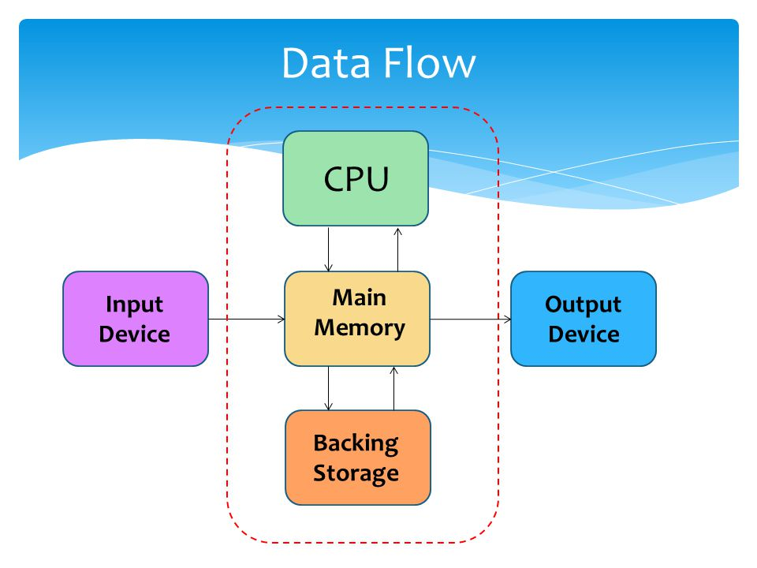

# 🇹🇯 Microsoft Developers Community in Tajikistan

**Шумо як қисми тағйирот шуда метавонед!**

Дӯстони азиз, фикр кунед: агар мо, ҳамон тавре ки барномаро менависем, худро низ барномарезӣ кунем, чи қадар ҷаҳони атроф тағйир меёбад? Инсон, вақте ки код менависад, на танҳо мошинро роҳбарӣ мекунад, балки ақли худро такмил медиҳад. Пас чаро мо худи барноманависон ба рушди тафаккури худ бештар аҳамият надиҳем?


👉 **“Тафаккур ва Дастурнависӣ” — чаро ин муҳим аст?**\
Баён мекунем: **Microsoft Developers Community Tajikistan** маҳз барои шумо, ҳамкасбон, ки ба беҳбудӣ, ихтироот ва омӯзиш диққат медиҳед, таъсис ёфтааст.

***

### **Мақсад ва Имкониятҳо**

#### 1. **Идея ва Рушд**

<figure><figcaption></figcaption></figure>

**Идеяҳо**:

* Бунёди ҷомеаи доно ва ҳамфикр.
* Инкишофи тарзи фикрронии таҳлилӣ.
* Имконият барои озмудани технологияи Microsoft дар лоиҳаҳои амалӣ.

***

#### 2. **Фаҳмиш ва Асосҳои Технология**

* **Ҷараёни маълумот дар компютер**:
  1. Истгоҳҳои маълумот (ввод/вивод).
  2. Қарори протсессор.
  3. Хабаргирӣ ба корбар.

<figure><figcaption></figcaption></figure>

***

**Чӣ тавр иштирок кардан мумкин аст?**

* Қисмгирӣ дар семинарҳо.
* Лоиҳаҳои дастҷамъии кушода(open-source).
* Курсҳои махсус барои омӯзиши барномасозии Web Application, Mobile Application,Desktop Application, Cloud Services ва Telegram Bot.
*
*

    <figure><figcaption></figcaption></figure>

***

### **Чӣ тавр як қисми ҷомеаи мо шавед?**

1. **Ҳозир бо мо тамос гиред**:
2. Аз лоиҳаҳои мавҷуда дидан кунед.
3. Ҳамчун ихтиёрӣ дар лоиҳаҳои дастҷамъӣ иштирок кунед.


Telegram Channel



GitHub Profile



Instagram profile



YouTube Channel


#### **Мо чӣ пешниҳод мекунем?**

* **Шумо** метавонед таҷрибаи худро бо дигарон нақл кунед.
* **Шумо** аз омӯзишҳои нав баҳра баред.
* **Шумо** як қисми ҷомеаи навовар шавед.

***

### **Хулоса**

Бо таъсиси **Microsoft Developers Community Tajikistan**, мо на танҳо барноманависонро муттаҳид мекунем, балки барои ҳар як иштирокчӣ имкониятҳои навро фароҳам меорем.

```csharp
Console.WriteLine("Бо ҳам фикр кунем, бо ҳам омӯзем, ва бо ҳам рушд ёбем!");
```
